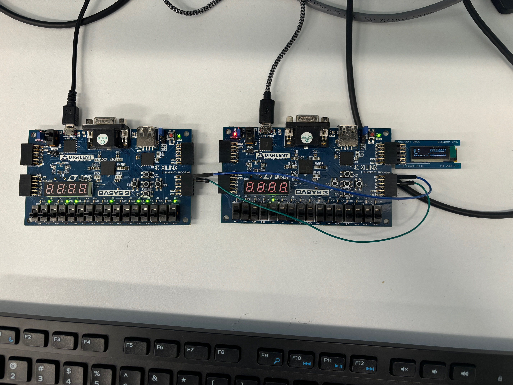

# IEEE_Standard_FP_Processor

This project provides the source code for board 1.

# Project SPECS

- Single-precision 32-bit floating-point numbers are used as inputs and outputs
- The processor performs multiplications and additions/subtractions.
- The input is a 66-bit stream starting with a 2-bit op-code, followed by two 32-bit
floating-point numbers A and B.
- Implementation of rounding method to -infinity
- Handles corner cases such as overflow, underflow, denormals, NaNs, and infinity
- Uses a Wallace tree multiplier with a Radix-4 Booth recoding scheme
- Uses a tree-structured CLA adder
- Multiplier and adder/subtractor are implemented on different FPGAS
- The host PC connects to the 1st FPGA (ADD/SUB) through UART. The 1st FPGA
connects to the 2nd FPGA (MUL) through I2C
- A stream of 32-bit outputs (results) and original values (A, B) goes to the OLED
(with HEX format)

# Final Setup Images

